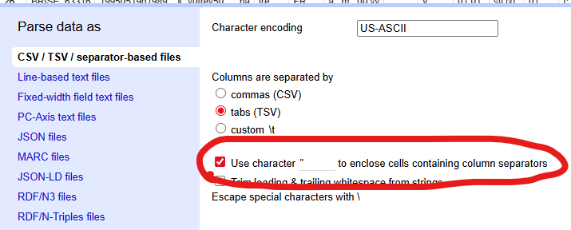

# Manipuler des exports tabulés provenant de MarcEdit

Note : par expérience, OpenRefine détecte mal que les données sont contenues entre guillemets, donc penser à bien le faire si nécessaire.

## Table des matières

* [Diviser le leader par partie](#diviser-le-leader-par-partie)
* [Diviser le 100$a par partie](#diviser-le-100a-par-partie)

## Diviser le leader par partie

JSON : [`json/diviser_leader.json`](./json/diviser_leader.json) (assume que le leader est contenu dans la colonne `000`)

_Edit column_ → _Split into several column..._ → _by field lengths_ : `5,1,4,1,1,5,3,4` + **do not guess cell type**

1. Pos. 0-4 : Longueur de la notice (_Record length_)
1. Pos. 5 : Statut de la notice (_Record status_)
1. Pos. 6-9 : Codes d'application (_Implementation Codes_)
1. Pos. 10 : Longueur de l'indicateur (_Indicator length_)
1. Pos. 11 : Longueur du cpde de sous-zone (_Subfield identifier length_)
1. Pos. 12-16 : Adresse de base des données (_Base address of data_)
1. Pos. 17-19 : Définition supplémentaire de la notice (_Additional record definition_)
1. Pos. 20-23 : Image du répertoire (_Directory map_)

## Diviser le 100$a par partie

JSON : [`json/diviser_100a_simple.json`](./json/diviser_100a_simple.json) ou [`json/diviser_100a_etendu.json`](./json/diviser_100a_etendu.json) (assument que la `100$a` est contenue dans la colonne `100$a`)

_Edit column_ → _Split into several column..._ → _by field lengths_ : `8,1,4,4,3,1,1,3,1,4,4,2` + **do not guess cell type**

1. Pos. 0-7 : Date de création de la notice (_Date entered on file_)
1. Pos. 8 : Type de date de publication (_Type of date_)
1. Pos. 9-12 : Date de publication 1 (_Date 1_)
1. Pos. 13-16 : Date de publication 2 (_Date 2_)
1. Pos. 17-19 : Type de public (_Target audience code_)
1. Pos. 20 : Type de publication officielle (_Government publication code_)
1. Pos. 21 : Modification des données transcrites (_Modified record code_)
1. Pos. 22-24 : Langue du catalogage (_Language of cataloguing_)
1. Pos. 25 : Translittération utilisée (_Transliteration code_)
1. Pos. 26-29 : Jeux de caractères utilisés (_Character set_)
1. Pos. 30-33 : Jeux de caractères supplémentaires (_Additional character set_)
1. Pos. 34-35 : Écriture du titre (_Script of title_)

Version avec les dates & character set fusionnées :  `8,1,8,3,1,1,3,1,8,2`

1. Pos. 0-7 : Date de création de la notice (_Date entered on file_)
1. Pos. 8 : Type de date de publication (_Type of date_)
1. Pos. 9-16 : Dates de publication (_Dates_)
1. Pos. 17-19 : Type de public (_Target audience code_)
1. Pos. 20 : Type de publication officielle (_Government publication code_)
1. Pos. 21 : Modification des données transcrites (_Modified record code_)
1. Pos. 22-24 : Langue du catalogage (_Language of cataloguing_)
1. Pos. 25 : Translittération utilisée (_Transliteration code_)
1. Pos. 26-33 : Jeux de caractères (_Character sets_)
1. Pos. 34-35 : Écriture du titre (_Script of title_)
