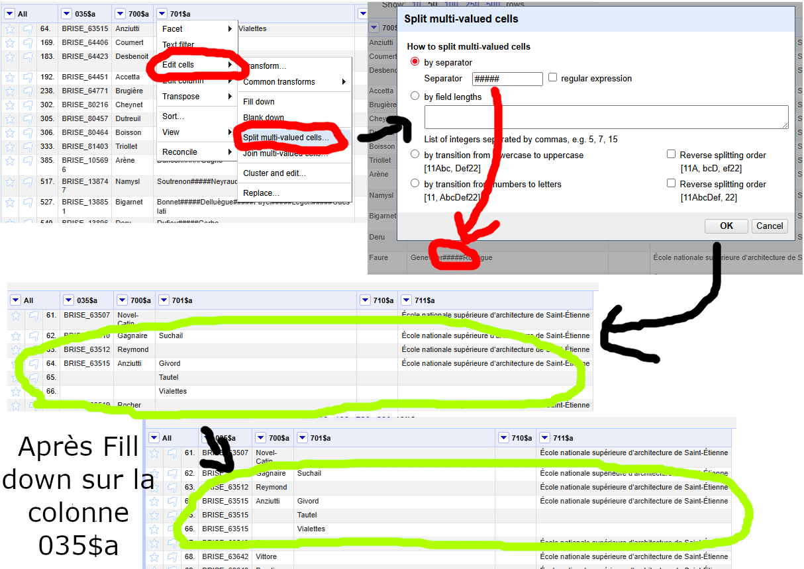

# Liste de manipulations utiles

Liste des manipulations qui ne requiert pas nécessairement de formules mais requiert d'intéragir avec l'interface.

Pour une liste de formules utiles, voir [le document dédié](./formules_utiles.md).

## Table des matières

* [Dupliquer des lignes pour séparer de multiples valeurs au sein d'une même cellule](#dupliquer-des-lignes-pour-séparer-de-multiples-valeurs-au-sein-dune-même-cellule)
* [Fusionner des lignes possédant la même clef](#fusionner-des-lignes-possédant-la-même-clef)

## Dupliquer des lignes pour séparer de multiples valeurs au sein d'une même cellule

* Modifier la colonne contenant les cellules à séparer et sélectionner la division des cellules à multiples valeurs (_Edit cells → Split multi-valued cells..._)
* Indiquer le séparateur
* Valider
* Modifier la colonne _All_ pour remplir les données vers le bas (_Edit columns → Fill down_)
  * **Attention** : si certaines colonnes de la ligne peuvent ne pas avoir de valeurs, priviligéier de remplir vers le bsa uniquement les colonnes qui contiennent toujours une donnée (_Edit cells → Fill down_)



### Fusionner des lignes possédant la même clef

* [Source](https://stackoverflow.com/questions/67466974/open-refine-regroup-rows-values-by-column-values)
* Sur la colonne de la clef, effectuer un _Sort_
* En haut, sélectionner sur le _Sort_ : _Reorder permanently_
* Sur la colonne de la clef, utiliser _Edit cells → Blank down_ pour passer en mode _record_
* Sur la colonne à fusionner, utiliser l'expression *GREL* suivante (_Edit cells → Transform..._) :

``` GREL
forEach(row.record.cells["COLONNE"].value,v,v).join("SEPARATEUR")
```

* Où :
  * `COLONNE` correspond au nom de la colonne que l'on souhaite fusionner
  * `SEPARATEUR` correspond au séparateur à utiliser entre les valeurs
* Note : effectuer la suite des opérations uniquement lorsque vous êtes sûr que toutes les colonnes sont correctement remplies pour la ligne contenant la clef
* Filtrer la colonne de la clef sur les données vides
* Supprimer les lignes vides en utilisant _All → Edit rows → Remove matching rows_